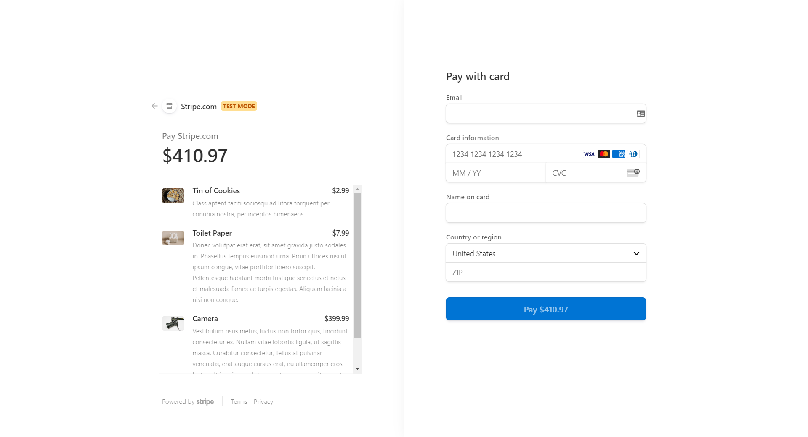

# Shop Shop

https://shopping-site-jim-redux.herokuapp.com/
https://github.com/1hoppy1/Shopping-Site-Redux

## Table of Contents

* [Description](#description)
* [Installation](#installation)
* [Contributing](#contributing)
* [Tests](#tests)
* [Questions](#questions)
* [Credits](#credits)

## Description 

This application is a layout for an online shopping store. You can see the items that are for sale. Add them to a shopping cart from the main screen or from the individual item description page. You may also pay for the items using stripe credit card processing services. You can login/logout and see your order history.

## Installation

This app is set up using Redux.

Repo at GitHub:
https://github.com/1hoppy1/Shopping-Site-Redux

Deployed at Heroku using Atlas MongoDB:
https://shopping-site-jim-redux.herokuapp.com/

## Contributing

Create an issue on GitHub:
https://github.com/1hoppy1/Shopping-Site-Redux

## Tests

Using Jest

## Questions

Comments, Questions, Concerns, Complaints? Create an issue on GitHub:
https://github.com/1hoppy1/Shopping-Site-Redux

## Credits

My Wife and my Mom